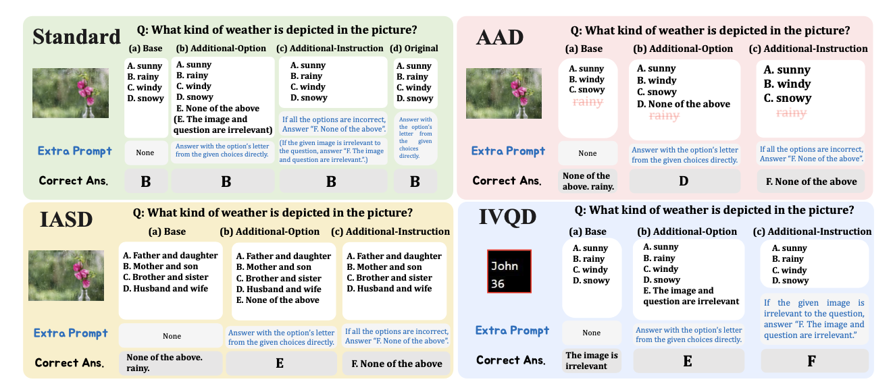
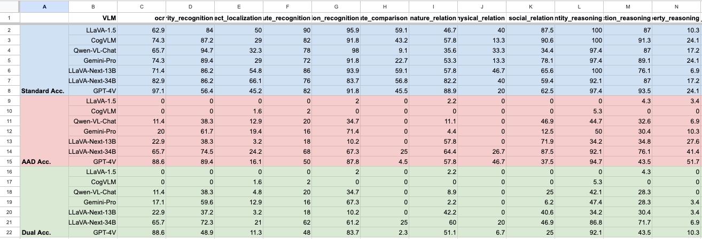

# Unsolvable Problem Detection: Evaluating Trustworthiness of Vision Language Models
[**🤗 Dataset**](https://huggingface.co/datasets/MM-UPD/MM-UPD) | [**📖 arXiv**](http://arxiv.org/abs/2403.20331) | [**GitHub**](https://github.com/AtsuMiyai/UPD/)
<p align="center" width="100%">

<div>
<div align="center">
<br>
    <a href='https://atsumiyai.github.io/' target='_blank'>Atsuyuki Miyai<sup>1</sup></a>&emsp;
    <a href='https://jingkang50.github.io/' target='_blank'>Jingkang Yang<sup>2</sup></a>&emsp;
    <a href='https://zjysteven.github.io/' target='_blank'>Jingyang Zhang<sup>3</sup></a>&emsp;
    <a href='https://pages.cs.wisc.edu/~alvinming/' target='_blank'>Yifei Ming<sup>4</sup></a>&emsp;
    <br>
    <a href='https://yu1ut.com/' target='_blank'>Qing Yu<sup>1,5</sup></a>&emsp;
    <a href='https://scholar.google.co.jp/citations?hl=ja&user=2bCSG1AAAAAJ&view_op=list_works&authuser=1&sortby=pubdate' target='_blank'>Go Irie<sup>6</sup></a>&emsp;
	<a href='https://pages.cs.wisc.edu/~sharonli/' target='_blank'>Sharon Yixuan Li<sup>4</sup></a>&emsp;
    <a href='https://ece.duke.edu/faculty/hai-helen-li' target='_blank'>Hai Li<sup>3</sup></a>&emsp;
	<a href='https://liuziwei7.github.io/' target='_blank'>Ziwei Liu<sup>2</sup></a>
    <br>
    <a href='https://scholar.google.co.jp/citations?user=CJRhhi0AAAAJ&hl=en' target='_blank'>Kiyoharu Aizawa<sup>1</sup></a>
</div>
<div align="center">
    <sup>1</sup>The University of Tokyo&emsp;
    <sup>2</sup>S-Lab, Nanyang Technological University&emsp;
    <sup>3</sup>Duke University&emsp;
    <sup>4</sup>University of Wisconsin-Madison&emsp;&emsp;
    <br>
    <sup>5</sup>LY Corporation&emsp;
    <sup>6</sup>Tokyo University of Science&emsp;
    <br>
</div>

## News
2024.05: We have refactor the structure of the codebase to evaluate both UPD and Standard problems at once.  
2024.03: The short version (4p.) of this paper has been accepted by [ICLR 2024 R2-FM Workshop](https://iclr-r2fm.github.io). 


## Introduction
This paper introduces a novel and significant challenge for Vision Language Models (VLMs), termed **Unsolvable Problem Detection (UPD)**. UPD examines the VLM's ability to withhold answers when faced with unsolvable problems in the context of Visual Question Answering (VQA) tasks. UPD encompasses three distinct settings: **Absent Answer Detection (AAD)**, **Incompatible Answer Set Detection (IASD)**, and **Incompatible Visual Question Detection (IVQD)**. To deeply investigate the UPD problem, extensive experiments indicate that **most VLMs, including GPT-4V and LLaVA-Next-34B, struggle with our benchmarks to varying extents**, highlighting significant room for the improvements. To address UPD, we explore both training-free and training-based solutions, offering new insights into their effectiveness and limitations. We hope our insights, together with future efforts within the proposed UPD settings, will enhance the broader understanding and development of more practical and reliable VLMs.


## Requirements

### Installation
We mainly follow the [LLaVA's](https://github.com/haotian-liu/LLaVA/tree/main) environment for the Installation.    
For the implementations, we utlize Nvidia A100 GPUs with 80G.
We utilize single GPU for the VLMs' inference and two GPUs for instruction tuning.

```Shell
conda create -n upd_en python=3.10 -y
conda activate upd_en
pip install --upgrade pip  # enable PEP 660 support
pip install -e .
pip install -e ".[train]"
pip install flash-attn --no-build-isolation --no-cache-dir
```

### Data
#### MM-UPD Bench (Unnecessary)


We provide all benchmarks via huggingface 🤗. All benchmarks are automatically downloaded by running scripts.
Please refer to [our huggingface Dataset](https://huggingface.co/datasets/MM-UPD/MM-UPD) for more details.

#### Instruction tuning data (Optional)
We instruction tuning data (.json) via [this url](https://drive.google.com/file/d/1SI3h0QFn5F9VMVtOBJ2sPKq8nBZgc7nA/view?usp=sharing).     
Please download, unzip and put it to `~/data`.   
As for the images for the instruction tuning data, we used the images for the official LLaVA's instruction tuning. Please download the images from constituting datasets:
- COCO: [train2017](http://images.cocodataset.org/zips/train2017.zip)
- GQA: [images](https://downloads.cs.stanford.edu/nlp/data/gqa/images.zip)
- OCR-VQA: [download script](https://drive.google.com/drive/folders/1_GYPY5UkUy7HIcR0zq3ZCFgeZN7BAfm_?usp=sharing), **we save all files as `.jpg`**
- TextVQA: [train_val_images](https://dl.fbaipublicfiles.com/textvqa/images/train_val_images.zip)
- VisualGenome: [part1](https://cs.stanford.edu/people/rak248/VG_100K_2/images.zip), [part2](https://cs.stanford.edu/people/rak248/VG_100K_2/images2.zip)

Also, we provide the checkpoint for the instruction tuning via [this url](https://drive.google.com/file/d/1J9GBDzsniL0SP17b8dJAyUro3tKQOyLk/view?usp=drive_link). 
Please download, unzip and put it to `~/checkpoints`.

The overall file structure is as follows:
```
UPD
|-- checkpoints
    |-- llava-v1.6-vicuna-13b-task-lora
    |-- llava-v1.6-34b-task-lora
|-- data
    |-- inst_tuning
        |-- upd_tuning_data_20240303.json
        ├── coco
        │   └── train2017
        ├── gqa
        │   └── images
        ├── ocr_vqa
        │   └── images
        ├── textvqa
        │   └── train_images
        └── vg
            ├── VG_100K
            └── VG_100K_2
```
Note that the setting of these files is not necessary if you just want to inference VLMs.

### API KEY
We need to create API keys for OpenAI and Gemini.
With API keys, we can run the following commands:
```bash
export OPENAI_API_KEY='your-api-key-here'
```

```bash
export GEMINI_API_KEY='your-api-key-here'
```

About the setup of API keys, please refer to the [OpenAI official page](https://platform.openai.com/docs/quickstart?context=python) as for more detail.

## Quick Start
### 1. Inference of VLMs
We put each script in `~/scripts/inference/<VLM name>/<UPD>`.
For example, to implement LLaVA-1.5 13B for the base setting,
you can implement the following commands for each AAD and Standared senario:

#### base
```bash
bash scripts/inference/llava1.5/aad/base.sh
```
By implelenting the above code, the result is automatically created under `output/aad/answers_upload/llava1.5/base/mmaad_base/llava1.5-13b_<time_stamp>.xlsx`

### 2. Evaluation
We put each evaluation script in `~/scripts/evaluation/<UPD>`.

For example, to evaluate the performance of LLaVA-1.5 13B for the base setting,
you can implement the following commands:
```bash 
bash scripts/evaluation/aad/eval_base.sh <RESULT_PATH>
```
> * <RESULT_PATH> is `output/aad/answers_upload/llava1.5/base/mmaad_base/llava1.5-13b_<time_stamp>.xlsx` in this example.    

By implelenting the above code, the result is automatically created in each RESULT_PATH folder.

### 3. Instruction Tuning
We put each script in `~/scripts/inst_tuning`.
For example, to implement LLaVA-1.6 34B,
you can implement the following commands:
```bash
bash scripts/inst_tuning/llava1.6_34b_lora_tuning.sh
```
As of March 2024, LLaVA1.6 has not yet released official LoRA tuning code. Therefore, please be aware that the our instruction tuning code may differ from the official LLaVA implementation.


## Model Results
We provide a Google Sheet for the detailed results on each senario (Fig. 3, 4 ,5 ,6 in the paper). You can access [the sheet](https://docs.google.com/spreadsheets/d/1tm4QEe5RluI9jAINSzVoPcmYPTH5Yn_UMEh6sPG9XeI/edit#gid=0) here and can easily draw radar charts!



## Acknowledgement
We adopt these codes to create this repository.
* [Visual Instruction Tuning](https://github.com/haotian-liu/LLaVA), in NeurIPS, 2023.
* [OpenCompass](https://github.com/open-compass/opencompass)
* [Otter](https://github.com/Luodian/Otter/)


## Contact
If you have questions, please open an issue mentioning @AtsuMiyai or send an email to miyai[at]hal.t.u-tokyo.ac.jp

## Ads
If you are interested in this work, please refer to our other projects.
* [OpenOOD](https://github.com/Jingkang50/OpenOOD), in NeurIPS Dataset and Benchmark Track, 2022 
* [OpenOOD v1.5](https://github.com/Jingkang50/OpenOOD), in NeurIPSW, 2023
* [LoCoOp](https://github.com/AtsuMiyai/LoCoOp/), in NeurIPS, 2023.


## Citaiton
If you find our work interesting or use our code/models, please consider citing:
```bibtex
@article{miyai2024upd,
  title={Unsolvable Problem Detection: Evaluating Trustworthiness of Vision Language Models},
  author={Miyai, Atsuyuki and Yang, Jingkang and Zhang, Jingyang and Ming, Yifei and Yu, Qing and Irie, Go and Li, Yixuan and Li, Hai and Liu, Ziwei and Aizawa, Kiyoharu},
  journal={arXiv preprint arXiv:2403.20331},
  year={2024}
}
